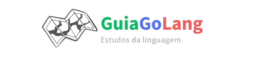

Esse projeto foi feito para fins de estudos da linguagem GoLang, utilizando conteúdos para conhecimento e resumos sobre novos aprendizados, irei adicionando a esse repositorio e colocarei em práticas esses novos conhecimentos.

## 🎉 Inicializando um projeto

Para iniciar um projeto go utilize o comando `go mod module` por padrão é usado o link do repositorio exemplo `go mod github.com/rodrigoPQF/go_learning` pois assim podera ser usado em repositorios externos.

## 📁 Pastas

### Padrão de nomes

Nome das pastas e dos arquivos sempre no singular, em letras minusculas e separados com underline (\_)

### Tipos de diretórios/pastas/arquivos

- /cmd : Responsável pelo entrypoint do sistema, onde ficará o main.go, recomendado ter subdivisões para cada tipo de entrypoint

- /internal : Arquivo e bibliotecas privados, lógicas de négocios e o coração do sistema, tudo que for interno, que não é possivel compartilhar para uso externo
- /pkg : Bibliotecas/Arquivos/Validações publicas, onde pode ser compartilhadas para uso em projetos externos.
- /docs : Documentação extras do projeto, não alocar o godoc nesta pasta
- /configs : Configurações de variaveis de ambiente, de PATHS
- /build : Empacotamento e CI
- /test : Testes externos como E2E, cypress
- /scripts : Scripts de operações para construção (Makefile), instalação e analises.
- /examples : Exemplos para bibliotecas e/ou aplicativos
- /website : Dados do site para o projeto
- /web : Ativos de Web estáticos, modelos do lado do servidor e SPAs
- /api : Documentação OpenAPI/Swagger

Layout feito com base no https://github.com/golang-standards/project-layout , com algumas adaptações.
